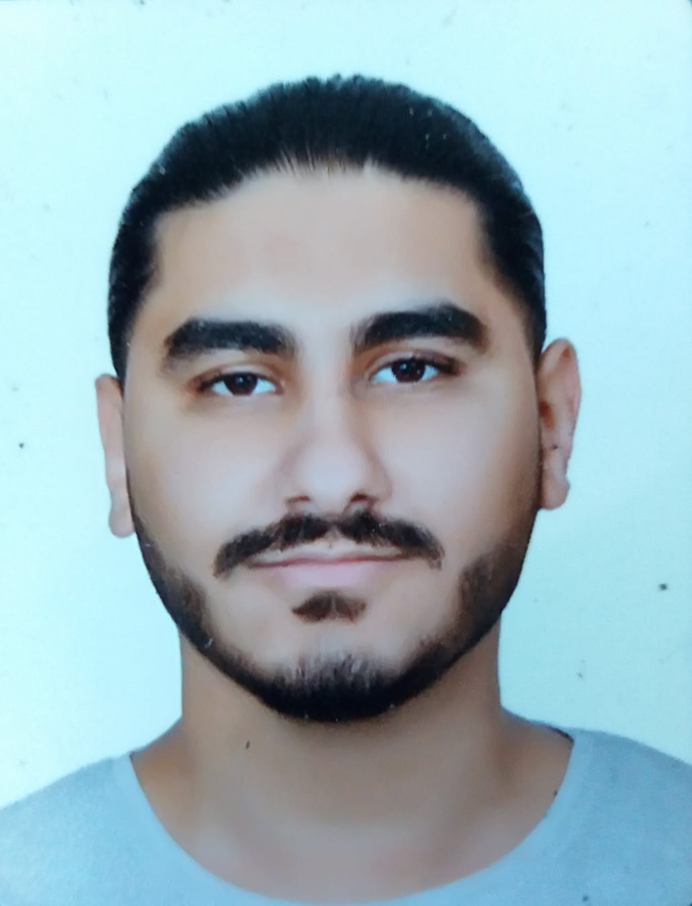

> ### Kamal Dia 
>
>
> ##### **Mobile**: (+961) 81859734
> ##### **Email**: kamal.dia.95@gmail.com
>
>
> ###### **Education**
>
>
> **Near East University **
>
> **Faculty of Civil and Environmental Engineering**
>
> B.Sc. in Civil Engineering
>
>
> ###### **Career**
>
>
> **Lebanese Engineering & Contracting Company**        Sidon, Lebanon
>
> Field Engineer                                      15 Sep 2020 – 1 Aug 2021 
> ‐ Day to day inspection of all construction works (columns, beams, slabs etc.) 
> ‐  Supervised/Guided workers and technicians, solving any problem to ensure work flow was not interrupted. 
> ‐ Kept track of availability and usage of materials and equipment. 
> ‐ Received ordered material or equipment. 
> ‐ Reported to project engineer with all technical details. 
>
> ###### **Internship**
>
>
> **Lebanese Engineering & Contracting Company           Sidon, Lebanon **
>
> Office engineer                                       10 Jun ‐10 Jul 2019
>
> ‐ ensured availability of materials, equipment, and quality control. 
> ‐ Certified the validity and accuracy of bills of works executed.
> ‐ Followed up progress on site and conducting meetings.
>
>
> **Atsa Insaat LTD.                                     Nicosia, TRNC**
>
>
> Field civil engineer                                 15 Feb ‐ 17 Mar 2019 
>
> ‐ Day to day basis supervision & inspection of all civil works as per company standards. 
> ‐ Reported daily activities to the Project Engineer with photos.
> ‐ Updated usage and availability of materials daily to avoid backlogs. 
> ‐ Directed and guided Technicians to their respective assigned duties. 
> ‐ Supervision of crews in support of underground installations, finish earth work, and paving.
>
>
> ###### **Volunteering**
>
> **Palestinian popular committee in Mar‐Elias refugee camp         Beirut, Lebanon**
>
> Field engineer (WASH project including R/O salt‐water treatment plant)    3 Aug 2021 ‐ present 
>
> ‐  Inspect sanitation and construction work. 
> ‐  Supervise technicians and workers. 
> ‐  Keep track of material and equipment. 
> ‐ Report to Popular committee. 
>
>
> ###### **Interpersonal Skills**
>
> ‐ Verbal and non‐verbal communication. 
> ‐ Developed good teamwork and leadership skills. 
> ‐ Ability to work under pressure. 
> ‐ Good negotiator. 
>
>
> ###### **Personal Data**
>
> **Nationality:** Lebanese 
> **Date of Birth:** 14.04.1995 
> **Driving License:** Lebanese public driving license, Turkish Republic of North‐Cyprus license
> **Languages:** Arabic (fluent), English (fluent), Turkish (basic)
> **Computer skills:** Microsoft Office (Word, Excel, and Power Point), SIDRA Intersection, 
SAP2000, AutoCAD. 
